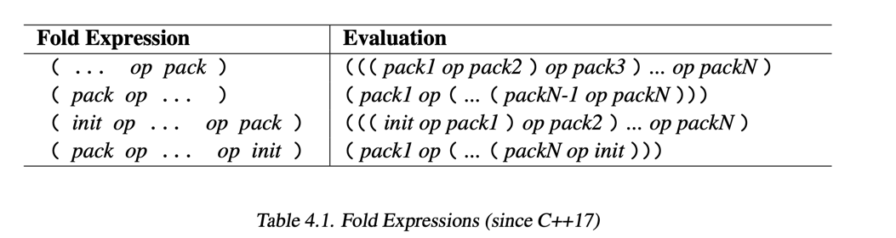

# Meta Programming

## Template in C++
### Partial Specialization
> A template specialization must specialize an existing primary template.
```c++
// Primary template
template <typename T>
struct Reverse;

// Edge case specialization
template <>
struct Reverse {
using Type = std::tuple<>;
};

// General cases
template <typename T, typename... Tails>
struct Reverse {
using TailReverse = typename Reverse<Tails...>::Type;
using Type = decltype(std::tuple_cat(
            std::declval<TailReverse>(), 
            std::declval<std::tuple<T>>()
            ));
   };
```
### Type Deducing
```c++
// deducing return type
template<typename T1, typename T2>
auto max(T1 a, T2 b) {
    return b < a ? a : b;
}
```
### `std::decay`
> a type trait used to transform a given type into its "by-value" equivalent by applying the same implicit conversions that occur when passing arguments to a function by value.
* When to Use
  * Primarily used in generic programming to determine the type that is needed to store a copy of a variable
* Use Cases
  * Storing types in generic containers
  * Modeling by-value function arguments
  * Working with `auto` type deduction: `std::decay<decltype<expr>> == auto`
### Alias Template
```c++
template<typename T>
   using DequeStack = Stack<T, std::deque<T>>;
 DequeStack<int>
```
### Nonetype Class Template Param
```c++
template<typename T, size_t Maxsize>
class Stack{
...
};
Stack<int, 10> a;
Stack<int, 20> b; // a different type from a
```
## Variadic Templates
> * A typical application is to pass an arbitrary number of parameters of arbitrary type through a class or framework.
> * Another application is to provide generic code to process any number of parameters of any type.

### Example
```c++
template <typename T, typename... Types>
void print(T first_arg, Types... args) {
    std::cout << first_arg << std::end;
    print(args...);
    std::cout << size_of...(Types) << "\n"; // print number of remaining types
}
```
### Fold Expression
Since C++17, there is a feature to compute the result of using a binary operator over all the arguments of a parameter pack (with an optional initial value).
For example, the following function returns the sum of all passed arguments:
```C++
template<typename... T>
auto foldSum (T... s) {
return (... + s); // ((s1 + s2) + s3) ... 
}
```


## `decltype` and `declval`
>decltype is a keyword that inspects the type of an expression, while std::declval is a utility function template used in conjunction with decltype to create a fictitious object of a given type in an unevaluated context, particularly useful in template metaprogramming. 

## Dependent Type Name Rule
> If something depends on a template parameter and refers to a nested type,
you MUST prefix it with typename.
> Conditions:
> 1. Inside a template
> 2. Referring to A<T>::Something 
> 3. And Something is a type
```C++
// Example
template <typename T>
struct B {
    using Type = T;
};
template <typename T>
void foo() {
    typename B<T>::Type x;
    int a; // not a type, it's known
}
B<T>::Type x; // not inside a template, it's known
```