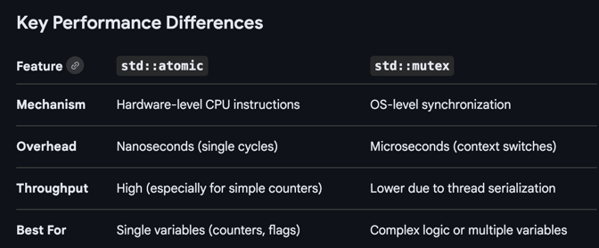

# Concurrency
## Lock: Mutex
> Protect shared data from being simultaneously accessed by multiple threads \
> Preventing data races and ensuring data consistency
```c++
#include <mutex>
std::mutex mtx; // exclusive
std::shared_mutex shared_mtx; // shared

std::unique_lock unique_lock(mtx);
std::shared_lock shared_lock(shared_mtx); // can also use unique

std::conditional_variable cv;
cv.wait(unique_lock, [&] {
        return true // or false checking condition
    });
    
cv.notify_one();
cv.notify_all();
```
### Generic Logical Implementation
* A counter: number of active readers
* Stat Flag: if a writer is currently active or waiting
* Condition Variables

## Lock-free: atomic
> * Implemented using a combination of special CPU instructions and compiler-level memory barriers
> * Neither copyable nor movable.
```c++
#include <atomic>
std::atomic<int> counter(0); // Can be user defined type that is trivial contructible

int val = counter.load();
counter.store(10);
counter++;
int old_val = counter.exchange(20);

int expected = counter.load();
bool succ = counter.compare_exchange_strong(expected, 10); // only updates the value if it matches the expected value
// if false, expected is updated with the actual current value
```
### Memory Ordering
> CPUs and compilers often shuffle instructions to run faster. Memory ordering is a way to control reordering.
> * by default: `std::memory_order_seq_cst` (sequential consistency) safest but slowest
* `memory_order_relaxed`: only guarantee it's atomic itself. 
  * [Usage] metrics or counters where the exact order relative to other variables doesn't matter.
  * fastest
* `memory_order_release` / `memory_order_acquire`
  * [Usage] Passing a "package" of data between threads(message queue)
  * "Release": Ensures all data you wrote before the store is "flushed" and visible to others
  * "Acquire": Acts as a receiver, if it sees the new value, it "acquires" visibility of all the data written by the Release thread.
  * ```c++
    struct Quote { double price; int size; };
    Quote global_quote; // Normal non-atomic data
    std::atomic<bool> quote_ready{false};

    // THREAD 1: Market Data Handler
    global_quote = {150.25, 100}; // 1. Write the data
    quote_ready.store(true, std::memory_order_release); // 2. "Release" it to others

    // THREAD 2: Strategy Engine
    if (quote_ready.load(std::memory_order_acquire)) { // 3. "Acquire" access
    // Guaranteed to see price 150.25, not 0.0 or old data
      process_trade(global_quote.price);
    }
  ```
### spin vs `yield` vs sleep
* spin
  * loop waiting. CPU fully occupied while doing nothing.
* yield: switch this thread out and schedule another thread on that core
  * Thread still stays in the ready queue 
  * ```text
    Thread calls yield()
    → syscall into OS kernel (e.g. sched_yield on Linux)
    → scheduler moves this thread from "running" to back of "ready queue"
    → picks next runnable thread
    → context switch (save registers, stack pointer, etc.)
    → another thread runs
    → eventually our thread gets scheduled again
    → returns from yield()
    ```
  * Cost: context switch, slow
    * safe status(register, TBL flushes, cache goes cold)
* sleep
  * slower than yield
  * Removed from scheduling entirely until the timer expires
  * Might sleep longer than instructed, depends on kernel HZ.
```c++
void backoff(int& spin_count) {
    if (spin_count < 10) {
        // Spin with pause hint — tells CPU this is a spin-wait loop
        // reduces power and helps sibling hyperthreads
        __builtin_ia32_pause();  // x86 PAUSE instruction
        spin_count++;
    } else if (spin_count < 50) {
        std::this_thread::yield();  // give up timeslice
        spin_count++;
    } else {
        std::this_thread::sleep_for(std::chrono::microseconds(1));
        // at this point queue has been full/empty for a while
        // sleep to stop wasting resources entirely
    }
}
```
### Hardware
* exclusive access on memory
### Complex operator: Compare and Swap Loops
## Lock-free Programming
> Achieved using atomic operation and techniques like Compare-and-Swap(CAS) loops

### `compare_exchange_weak` `compare_exchange_strong`
> * `compare_exchange_weak`: may fail even if value is the same, used in a loop
> * `compare_exchange_strong`: only fail when value are different, handles any internal retries to ensure success, only do one shot try
```c++
void increment() {
    int expected = counter.load();
    // Loop until we successfully swap 'expected' with 'expected + 1'
    while (!counter.compare_exchange_weak(expected, expected + 1)) {
        // 'expected' is automatically updated with the current value on failure
    }
    
    
     std::atomic<int> shared_val(10);
    int expected = 10;
    int desired = 20;

    // Strong version: only fails if shared_val != expected.
    // If it fails, 'expected' is updated with the current value of shared_val.
    if (shared_val.compare_exchange_strong(expected, desired)) {
        std::cout << "Success! Value updated to 20.\n";
    } else {
        std::cout << "Failed. Current value was: " << expected << "\n";
    }
}
```
## Performance: Mutex vs Atomic
> In general, atomics significantly outperform mutexes for simple operations. \
> Because they operate at the hardware level, avoiding the expensive operating system "kernel calls" and "context switches" required by locks.


## Race condition
> Multiple threads or process access shared data concurrently, and the final outcome depends on the unpredictable timing and sequence of their execution.

## Dead lock
> occurs in a multithreaded environment when two or more threads are blocked indefinitely, each waiting for a resource that the other is holding. This causes the program to freeze or become unresponsive.

### Some Symptoms
* CPU: drops to zero, enter waiting state
* Memory: stable or increase
* Pending Task: accumulate rapidly
* Recovery: manual restart