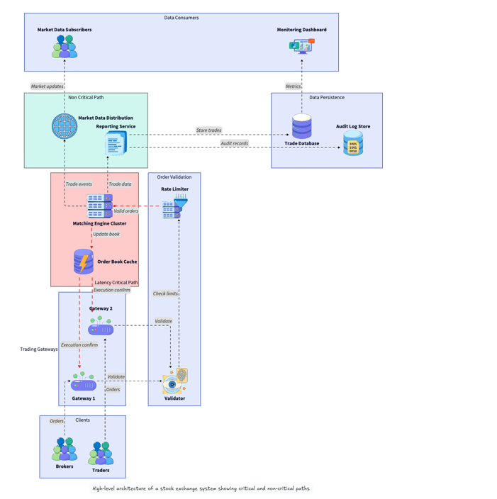

# Trading System Design
## General Pipeline
> Market Data → Signal Generation → Order Decision → Risk Check → Order Routing → Exchange → Execution → Position Update
### Market Data Feed Handlers
> * Receives list quotes/trades from exchanges (TCP/UDP)
> * Parses packets efficiently
> * Publishes internally for trading logic (Publisher & Subscriber)
>   * lock-free ring buffer // TODO: try implementing it 
> * One thread per feed, pinned to a CPU core
>   * Avoid context switch
### Normalized Order Book
> Maintain current market state per instrument \
> **Read by strategy engine, written by market data handler**

### Trading Strategy Engine
> * Implements algorithms: arbitrage, market making
> * Processes market data to generate orders

### Order Manager / Execution System
> * Sends orders to exchange
> * Tracks order state
> * Handles acknowledgements/cancellations

### Risk/Compliance
> * Checks trade limits, prevents catastrophic positions
> * Fast AND correct

## Example: Strategy Management Platform
> * Input: market data
> * Output: decision
> * Other features: support strategy switch in real time
```text
Market Data Feed
       ↓
 [Market Data Handler]
       ↓
 [Normalized Order Book]
       ↓
 [Strategy Engine]  ←──── [Strategy Config Manager]
       ↓                         ↑
 [Risk Manager]          [User/Admin Interface]
       ↓
 [Order Router]
       ↓
   Exchange
       ↓
 [Execution Handler]
       ↓
 [Position & PnL Tracker]
```
### Strategy Config Manager
> Problem: update param without stopping the strategy, safe concurrent access without adding latency to hot path\
> Solution: **Double buffering + Atomic pointer swap**
```c++
class StrategyConfig {
public:
    double threshold;
    int    max_position;
    bool   enabled;
};

class ConfigManager {
    // Two config slots
    alignas(64) StrategyConfig configs[2];
    std::atomic<StrategyConfig*> active;  // hot path reads this

public:
    // Called from hot path — zero cost, just pointer dereference
    const StrategyConfig* get() const {
        return active.load(std::memory_order_acquire);
    }

    // Called from config update thread — safe, non-blocking
    void update(const StrategyConfig& newConfig) {
        StrategyConfig* current = active.load();
        StrategyConfig* inactive = (current == &configs[0]) 
                                    ? &configs[1] : &configs[0];
        *inactive = newConfig;  // write to inactive slot
        active.store(inactive, std::memory_order_release); // swap with active
        // old config still valid until next update
    }
};
```
#### Config Updates on Distributed System
* Solution A: Config w/ version number
  * Skip ticks until the node has confirmed to be updated to the correct version
  * Trade off: miss ticks -> lose money
* Solution B: Centralized Config Service with Consensus
  * All nodes subscribe to config service, acknowledge receipt before the update is condiered "applied"
* Solution C: Epoch-Based Strategy Switching
  * treat each config change as a **new strategy epoch**
  * Preload the new epoc before activation
  * A **global barrier** signal tells all nodes to switch simultaneously

## Example: Stock Exchange System
> [Details](https://www.systemdesignhandbook.com/guides/design-a-stock-exchange-system/)

### Functional Requirements
> Focus on order placement, matching and execution
* [Order Submit] Allowing users or brokers to submit buy and sell orders for financial instruments
* [Risk Validation] Validating these orders against basic constraints and risks limits
* [Order Matching] Matching compatible orders according to deterministic price-time priority rules
* [Result Persistence] Persisting the results so participants can see their executed trades
### Non Functional Requirements
* Low predictable latency
* Very high throughput
* Strong consistency(deterministic ordering guarantees)
* High availability

## Example 2: Order Bool
### Functional Requirement
* `add_order(order)` — insert at the right price level, create level if new
* `cancel_order(order_id)` — remove a specific order (requires an order ID → location map for O(1) lookup)
* `match_order(market_order)` — consume the best ask (for buys) or best bid (for sells), possibly partial fills
* `get_best_bid()` / `get_best_ask()` — O(1)
* `get_spread()` — difference between best ask and best bid

### Nonfunctional Considerations
* Predictable latency
* Cache Locality
* CPU

### Solutions
* SortedMap(price->order_queue), UnorderedMap(order_id->order_ptr)
  * two heap version can't delete order efficiently
  * predictable latency
  * work for most scenarios
  * bad cache locality
* Vector of order queue indexed by price
  * good for bounded price
  * pre-alloc all levels
  * good cache locality
  * O(n) scan or track
* Vector of order sorted by price
  * bst insert/remove
  * good for few active levels
  * compact, cache friendly
* 
## Callbacks in C++
> * `std::function` for flexibility
> * Template-based callbacks to eliminate runtime overhead


### 1. Market Data Processing
> Use Case: A "Feed Handler" receives raw UDP packets from an exchange, decodes them into a structured format, and triggers a callback to all subscribed trading strategies.
* Use **CTPR(Curiously Recurring Template Pattern)** or **Compile-time Policy** callbacks to avoid the overhead of virtual function calls or `std::function`.


### 2. Order Lifecycle Management
> Use Case: An Order Management System (OMS) uses callbacks to update risk limits or notify a UI whenever a "Fill" event is received from the FIX engine.
* **Disruptor Pattern** with lock-free callbacks to pass order events between threads with minimal cache misses.

## Terms
* Instruments
  * Definition: Any tradable asset, security or contract
  * Purpose: used to transfer value, store wealth, or manage risk
  * Examples:
    * Equities/Stocks
    * Fixed Income/Bonds
    * Forex
    * Commodities
    * Derivatives
* Ticks
  * The smallest possible price movement for a specific financial instrument on a exchange.
  * Tick size: Exchange matching engines are programmed to only accept price levels that are integer multiples of the tick size.
    * tick size: 0.05, order at 0.03(reject), order at 0.05, -0.05, 0.1(valid)