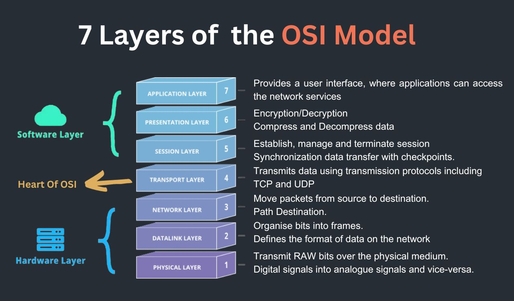
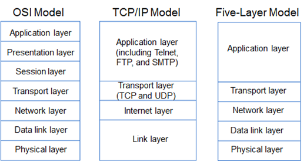
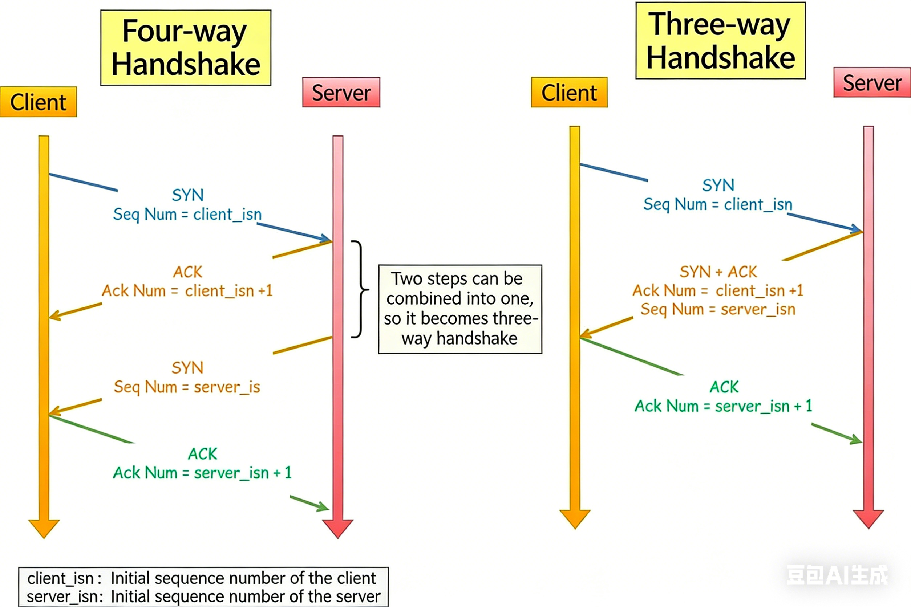

# Network
## The 7 OSI Model Layers (Top to Bottom):
* Layer 7: Application Layer: Interacts directly with software applications to provide network services 
  * (e.g., HTTP, FTP, SMTP, DNS).
* Layer 6: Presentation Layer: Formats, encrypts, and compresses data for the application layer, ensuring compatibility 
  * (e.g., SSL/TLS, ASCII, JPEG).
* Layer 5: Session Layer: Manages, maintains, and terminates connections between applications on different devices
  * (e.g., SYN/ACK, API sessions, RPC).
* Layer 4: **Transport Layer**: Handles end-to-end communication, flow control, and error correction 
  * (e.g., TCP, UDP, port numbers).
* Layer 3: **Network Layer**: Manages logical addressing (IP addresses) and routing data packets across networks 
  * (e.g., IP,ICMP,IGMP,Routers).
* Layer 2: Data Link Layer: Handles **node-to-node** data transfer, physical addressing (MAC addresses), and error detection
  * (e.g., Switches, Bridges, Ethernet).
* Layer 1: Physical Layer: Transmits **raw bitstreams** over physical media
  * (e.g., Wi-Fi, cables, hubs, NICs, optical signals).
  
## TCP/IP 5 Layer model

## TCP
### Handshakes
> 3 Handshakes to connect, 4 Handshakes to disconnect 
> * Why 3 handshakes for connection: avoid old duplicate connection
> * Why 4 handshakes for disconnection: After the client send FIN, the server can still send more data, when it's done sending data, it'll send a FIN back to client.

### Congestion Control
1. Slow start phase: probing network capacity, exponential increase after one RTT(round trip time).
2. Congestion Avoidance: slow increase by 1
3. Congestion Detection: goes back to stage 1 or 2.
   3.1 Detection: by packet loss or duplicate ACK

#### Fast retransmission
> When receiver receive packets out of order, it sends duplicate(3) ACKs
> This way the sender bypass the long time timeout by resending the packet when receiving duplicate ACKs.

#### Fast recovery
> Cut the threahold into half instead of going back to stage 1.
> Slowing increase from this halved thres.

## UDP
> Market Data use UDP multicast
> * One sender, multiple receivers

### Data Loss Solution
Exchanges provide:
* Sequence numbers
* Snapshot recovery channel
* Gap request protocol

Solution:
* Track sequence numbers
* Detect gaps
* Request replay
* Use snapshot sync
## Data Pack/Unpack
### 1. Packing: The Sending Process
Before data leaves your device, it goes through a process of encapsulation, where more information is added at each layer of the network stack.
* Segmentation (**TCP**): The original file is broken into smaller chunks. 
* Packet Structuring: Each packet is given **a header and a trailer**. 
* Header: Contains the source IP address, destination IP address, sequence number (for reordering), and port numbers. 
* Payload: The actual portion of the data being sent. 
* Trailer: Contains error-checking information (e.g., checksum) to ensure the data is not corrupted during transit. 
* Encapsulation: The packet is placed inside a frame (layer 2) to prepare it for transmission over local hardware (Ethernet or Wi-Fi). 
* Transmission: The data is converted into physical signals (light or electrical pulses) and sent across the network.
2. Routing: Moving Across the Internet 
* Packets often travel independently to their destination. 
* Independent Paths: Each packet may take a different route through routers based on network traffic and efficiency. 
* Routers: Routers check the destination IP address in the header and forward the packet to the next, most efficient, "hop".
3. Unpacking: The Receiving Process 
Once packets reach their destination, the process is reversed to reassemble the original data.
* Reception & Verification: The receiving network interface checks the packet for errors using the trailer. 
* Decapsulation: The headers are stripped off, moving up the protocol stack, and the data is inspected. 
* Reassembly (TCP): The receiving device uses the sequence numbers in the headers to put the packets back in the correct order.
* Handling Errors: If a packet is lost or corrupted, TCP requests a retransmission of that specific packet, not the entire file.

## Address Lookup
### Routing - IP Address
> * When a router receives a data packet, it doesn't "know" the final destination's physical location.
> * Instead, it performs a routing table lookup to find the next hop.
* Longest Prefix Match: the router compares the destination IP address against its *routing table*.
  * It looks for the entry that matches the most bits of the IP address -- the longest prefix
* AND Operation: the router uses a subnet mask and performs a bitwise `AND` operation with the destination IP to determine which network segment the packet belongs to.
* Default Gateway: no specific match is found the router sens the packet to a gateway.

### DNS(Domain Name Service) -  Named Address
> Return IP address
* Step1: check computer's local cache
* Step2: DNS solver(provided by ISP) to find the address
  * Tree hierarchy lookup

## Socket Programming in C++ // TODO